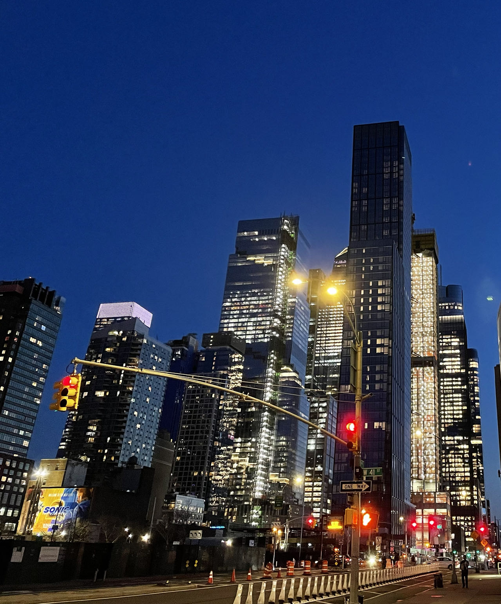
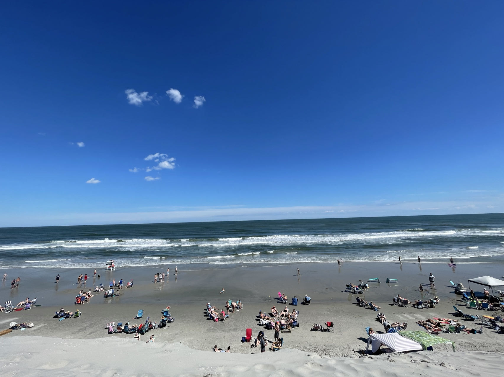
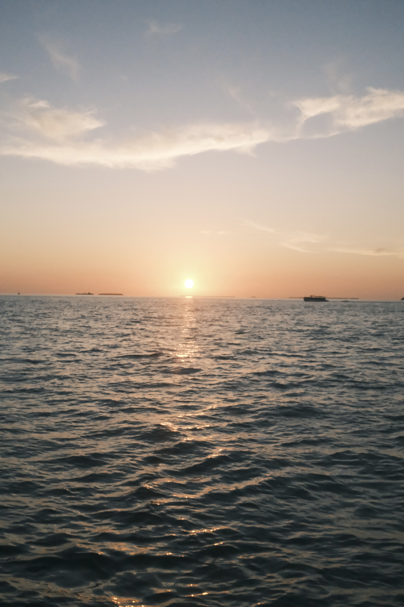



Here are some photos taken by me, and I will update them randomly :-) 

<link rel="stylesheet" href="../assets/css/stylesheet.css" /><meta name="viewport" content="width=device-width, initial-scale=1.0" />

  

 
<h1_hover>Dongting Lake</h1_hover>
Nov 2021

 
<h1_hover>Philadelphia</h1_hover>
Dec 2021

 

 
<h1_hover>New York</h1_hover>
April 2022

    

 
<h1_hover>North Wildwood</h1_hover>
May 2022

 
<h1_hover>Miami</h1_hover>
Jan 2023

 
<h1_hover>San Antonio</h1_hover>
May 2023

 
<h1_hover>San Diego</h1_hover>
June 2023

 
<h1_hover>Las Vegas</h1_hover>
July 2023

 
<h1_hover>Antelope Canyon</h1_hover>
July 2023

 
<h1_hover>Horseshoe Bend</h1_hover>
July 2023

